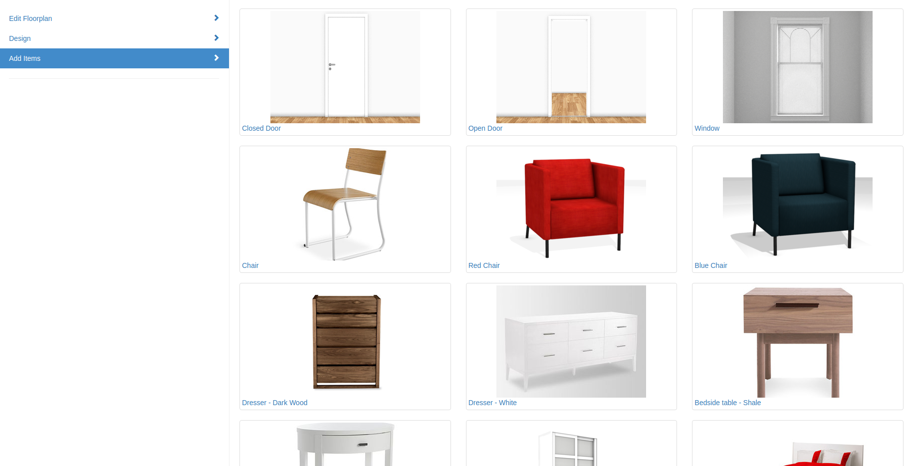

# Home Decor VR

## What is this?

This is a customizable application built on three.js that allows users to design an interior space such as a home or apartment. Below are screenshots from our Example App. 

1) Create 2D floorplan:


2) Add items:



3) Design in VR:


## Developing and Running Locally

To get started, clone the repository and ensure you npm >= 3 and grunt installed, then run:

```bash
    npm install
    grunt
```

The latter command generates `example/js/blueprint3d.js` from `src`.

The easiest way to run locally is to run a local server from the `example` directory. There are plenty of options. One uses Python's built in webserver:

```bash
    cd example

    # Python 2.x
    python -m SimpleHTTPServer

    # Python 3.x
    python3 -m http.server
```

Then, visit `http://localhost:8000` in your browser.

## Running in Production

Clone the repository and start the Docker container as:

```bash
    docker-compose build
    docker-compose up
```

Then, visit `http://localhost:3000` in your browser.

## Directory Structure

### `src/` Directory

The `src` directory contains the core of the project. Here is a description of the various sub-directories:

`core` - Basic utilities such as logging and generic functions

`floorplanner` - 2D view/controller for editing the floorplan

`items` - Various types of items that can go in rooms

`model` - Data model representing both the 2D floorplan and all of the items in it

`three` - VR view/controller for viewing and modifying item placement


### `example/` Directory

The example directory contains an application built using the core blueprint3d javascript building blocks. It adds html, css, models, textures, and more javascript to tie everything together.
